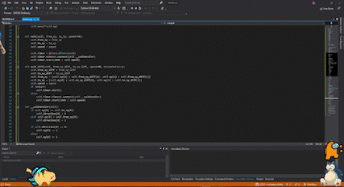

# Wallpaper Sticker

Add your favoirte characters on your desktop.

PyQt5 is used with Python.

Resolution used: 1920x1080



## Run

```
python Sticker.py
```


## Usage

```
s3 = Sticker('images/pokemon/pikachu1.gif', xy=[0, 910], size=0.8, on_top=True)
    s3.walk(from_xy=[0, 910], to_xy=[1600, 910], speed=400)
```

- Use `gif/pokemon/pikachu1.gif` file
- Put the gif animation to `(0, 910)` screen coordinates (x, y) -> initial position
- Resize the image to `80% (0.8)`
- Always on top to `True`
- Move the image from `(0, 910)` to `(1600, 910)` with velocity `180`

